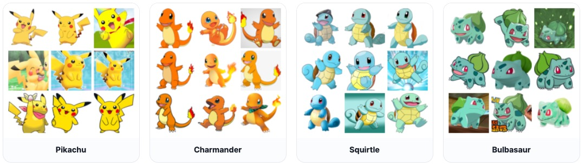

---
hide:
  - navigation
---

# AIC313/CS378: Introduction to Generative Models

<h3><b>
<a href="http://mhsung.github.io/" target="_blank">Minhyuk Sung</a>, <a href="https://www.kaist.ac.kr/" target="_blank">KAIST</a>, Fall 2026
</b></h3>


## FastGen Challenge

^^**Mid-Term Evaluation Submission Due (Optional)**^^: ==October 31 (Saturday), 23:59 KST==  
^^**Final Submission Due**^^: ==November 14 (Saturday), 23:59 KST==  
^^**Where to submit**^^: ==KLMS==  


[Introduction Slides]({{links.fastgen_slides}}){:target="_blank" .md-button}
[Base Code]({{links.fastgen_repo}}){:target="_blank" .md-button}


### Goal
**TL;DR: Your goal is to generate Pokemon images FAST!**

In this challenge, you will implement and train your own **image generation models**. The goal is to achieve **high-quality image generation with only a few sampling steps**. You are encouraged to explore advanced techniques for few-step generation.


### What to Do
We provide the **model skeleton code** and the **evaluation code**. Your goal is to **design and implement your own image generation models**, including:

- **Few-step generation framework**: either use an existing framework or design your own generative model.
- **Model architecture design**: design a good model backbone.
- **Other training details**: data augmentation, learning rate, optimizer, etc.

Specifically, your tasks are as follows:

1. **Implementing Your Own Models**
    - You may modify the provided code (`model.py`) and add new files if necessary.
    - You must implement the **following two models** used by the evaluation code:
        - `class ModelOneNFE(Model)`: Model for 1-NFE generation
        - `class ModelFewNFE(Model)`: Model for few-NFE generation
    - **DO NOT** modify `class Model(nn.Module)`.

2. **Training the Models**
    - You may freely use your own training pipeline, including model training and dataset preparation.
    - You may train the two models (`ModelOneNFE` and `ModelFewNFE`) separately or let them share weights. You may also train auxiliary networks (e.g., a teacher model for distillation) from scratch, as long as they are not used at sampling time.
    - You can design your own model, but there are some restrictions:
        - The total parameter size of **each** model should be less than **60,000,000 (60M)**.
            - Parameters are counted with the provided utility in `src/utils.py` on the model as loaded for sampling. Every learned network used at sampling time counts toward this budget; networks used only during training (e.g., a teacher) do not.
        - The peak VRAM while training the model should be less than **20GB** (single GPU, measured with `torch.cuda.max_memory_allocated()`). Report the measured value in your write-up.
        - Utilizing any pretrained model is **prohibited**. Everything must be trained from scratch on the provided training split. (The Inception network used inside the provided FID evaluation code is the only exception.)

3. **Sampling Images**
    - You should also implement your model's sampling code (`Model.sample()`) for each model within the pre-defined NFE limit.
        - `ModelOneNFE.sample()` must use exactly **1 NFE**.
        - `ModelFewNFE.sample()` may use **any number of NFEs up to 4** (i.e., 2, 3, or 4).
    - **NFE**: Number of Function Evaluations (= Sampling Steps).
        - Any use of the trained model backbone, **even partially**, will be counted as 1 NFE.
        - Any other learned network evaluated during sampling (e.g., a refiner or decoder) also counts as 1 NFE per evaluation, and its parameters count toward the 60M budget.
    - Check out the [Recommended Readings](#recommended-readings) section, but you are _not_ limited to implementing one of the algorithms introduced in those papers; they are provided only as references.


**==Important Notes==**

^^PLEASE READ THE FOLLOWING CAREFULLY! Any violation of the rules or failure to properly cite existing code, models, or papers used in the project in your write-up will result in a zero score.^^

- **DO NOT** use any pretrained model. You must train the model from scratch.  
- **DO NOT** modify the provided files marked as `DO NOT modify` in the [Codebase Structure](#codebase-structure) (`dataset.py`, `download_dataset.py`, `evaluate.py`, `src/utils.py`, and the data split files). These are kept fixed to ensure consistent evaluation across all submissions.  
- **DO NOT** modify `class Model(nn.Module)` in `model.py`.  
- **DO NOT** use the validation split for training. Only the training split is allowed for training your model. TAs may inspect your training code and data pipeline to verify this.  
- You are allowed to use open-source implementations, as long as they are **clearly mentioned and cited** in your write-up.  


### Dataset

You are required to use the [Pokemon Generation One](https://www.kaggle.com/datasets/bhawks/pokemon-generation-one-22k){:target="_blank"} image dataset for training and evaluation. It consists of 20,099 images across 151 Pokemon categories.

{ width=80% }

- We will provide the **training / validation split** for the dataset.
    - Training set: 17,079 images
    - Validation set: 151 categories × 20 = 3,020 images
- You are only allowed to use the **training split** for training your model. The **validation split** will be used for the evaluation.
- We use **64×64** down-sampled images for computation efficiency.

**You do not need to download the dataset yourself.** The base code includes a script (`download_dataset.py`) that automatically downloads the dataset.


### Codebase Structure

```
AIC313-CS378-Project-FastGen/
├── model.py                      # NFE-specific model classes (students SHOULD modify subclasses)
├── dataset.py                    # Pokemon dataset and DataLoader API (provided, DO NOT modify)
├── download_dataset.py           # Kaggle dataset download utility (provided, DO NOT modify)
├── evaluate.py                   # Sample generation and FID evaluation (provided, DO NOT modify)
├── src/
│   ├── __init__.py
│   └── utils.py                  # Parameter counting utilities (provided, DO NOT modify)
└── data/
    └── pokemon-generation-one-22k/
        ├── train_split.txt       # Fixed training split (provided, DO NOT modify)
        ├── val_split.txt         # Fixed validation split (provided, DO NOT modify)
        └── category_to_id.json   # Fixed category-to-ID mapping (provided, DO NOT modify)
```

- **DO NOT modify**: Files that must be kept as-is (for fair comparison).
- **SHOULD modify**: Main files for implementing your solution (`model.py`).
- The base code does **not** include a training script. You should write your own (e.g., `train.py`) and can freely add any other files you need.
- Use the `requirements.txt` provided in the base code repository as the reference for the TAs' evaluation environment. If your code needs additional packages, list them in your own `requirements.txt` in the submission.

Further details are provided in the `README.md` of the [base code]({{links.fastgen_repo}}){:target="_blank"}.


### Evaluation

This is a **team-based competition**. The performance of your image generative models will be evaluated quantitatively using [Fréchet Inception Distance (FID)](https://en.wikipedia.org/wiki/Fr%C3%A9chet_inception_distance){:target="_blank"} scores at **NFE = 1** and **NFE ≤ 4**. The **validation split** will be used as the reference set for FID.

- You may compute FID yourself, but **TA-measured scores are official**.
- TAs will run your code **as-is** in their environment. Submissions that fail to run are scored as zero for the corresponding metric.
- Mid-term evaluation results will be published on the leaderboard.
- At the mid-term evaluation, the **top-3 submissions that also outperform the TAs' result earn bonus credit**.

**Final grading will be determined relative to the best FID achieved for each metric.** You can get a total of **20 points** from the FastGen project:

| Item | Points |
| --- | --- |
| FID at NFE = 1 | 8 |
| FID at NFE ≤ 4 | 8 |
| Write-up | 4 |

For each FID metric, the team with the lowest (best) FID sets the benchmark, and the score is computed as follows (lower FID is better):

$$
\text{Score} = 8 \times \frac{\text{Best FID among all teams}}{\text{Your FID}}
$$


### Mid-Term Evaluation Submission (Optional)
The purpose of the mid-term evaluation is to check your team's standing among others. **Participation is optional**, but the **top-3** submissions that outperform the TAs' result will earn **bonus credit** toward the final grade.

- **Due**: ==October 31 (Saturday), 23:59 KST== (two weeks before the final submission)
- **What to submit**
    1. **Self-contained source code** 
        - Your submission must include the complete codebase.
        - TAs will run your code in their environment with no changes.
    2. **Model checkpoint(s) and configs**  
        - Checkpoint path: `./checkpoints/one_nfe.ckpt` and `./checkpoints/few_nfe.ckpt`
        - ^^TAs load from these paths. Different paths will FAIL.^^
        - If your model needs any configuration files to be loaded (e.g., architecture hyperparameters), include them in the submission and make sure `model.py` reads them without any manual step.
- **Evaluation**
    - The FID results will be published on the leaderboard.
    - The TAs' FID scores (from their own implementation; code will not be released) will be published on the leaderboard together with the mid-term results as a yardstick.
    - The top-3 submissions that outperform the TAs' result will earn bonus credit.  

**Example of Mid-Term Submission**

```
team_XX/                      # XX: your two-digit team ID (e.g., team_01)
├── model.py                  # ModelOneNFE, ModelFewNFE, and Model
├── train.py                  # Student training script
├── dataset.py                # Provided dataset/DataLoader interface
├── download_dataset.py       # Provided dataset downloader
├── evaluate.py               # Provided evaluation entry point
├── src/
│   ├── __init__.py
│   └── utils.py              # Provided parameter-counting utilities
├── requirements.txt          # Additional packages your code needs (if any)
├── checkpoints/
│   ├── one_nfe.ckpt          # REQUIRED
│   └── few_nfe.ckpt          # REQUIRED
└── <all additional files>    # Include every file you implemented
```


### Final Submission
- **Due**: ==November 14 (Saturday), 23:59 KST==
- **What to submit**:
    1. **Self-contained source code** (same as the mid-term evaluation submission)
    2. **Model checkpoint(s) and configs** (same as the mid-term evaluation submission)
    3. **2-page write-up**
        - No template provided.  
        - Maximum of two A4 pages, excluding references.  
        - All of the following must be included:
            - **Technical details**: One-paragraph description of the technical details of your few-step generation implementation.
            - **Training details**: Training logs (e.g., training loss curves), total training time, and peak VRAM usage.
            - **Qualitative evidence**: 8 sample images from the early training phases, and 8 sample images from the final model at each of NFE = 1 and NFE ≤ 4.  
            - **Citations**: All external code, and papers used must be properly cited.
        - ^^Missing any of these items will result in a penalty.^^
        - ^^If the write-up exceeds two pages, any content beyond the second page will be ignored, which may lead to missing required items.^^


### Self-Evaluation Checklist
Before submitting, please check the following:

- [ ] Use the `requirements.txt` in the base code repository for a compatibility check.
- [ ] Each model has fewer than 60M parameters (check with `src/utils.py`).
- [ ] Code runs end-to-end (Train → Sample → Evaluate) without errors.
- [ ] Correct checkpoint paths are set (`./checkpoints/one_nfe.ckpt`, `./checkpoints/few_nfe.ckpt`).
- [ ] Citations are ready: all external code/papers are cited in the final write-up.


### Grading
^^**There is no late day. Submit on time.**^^  
**Late submission**: ==Zero score==.  
**Missing any required item in the final submission (code, checkpoints, write-up)**: ==Zero score==.  
**Missing items in the write-up**: ==10% penalty for each==.  


### Recommended Readings
[1]  [Song et al., Consistency Models, ICML 2023.](https://arxiv.org/abs/2303.01469){:target="_blank"}  
[2]  [Kim et al., Consistency Trajectory Models: Learning Probability Flow ODE Trajectory of Diffusion, ICLR 2024.](https://arxiv.org/abs/2310.02279){:target="_blank"}  
[3]  [Liu et al., Flow Straight and Fast: Learning to Generate and Transfer Data with Rectified Flow, ICLR 2023.](https://arxiv.org/abs/2209.03003){:target="_blank"}  
[4]  [Frans et al., One Step Diffusion via Shortcut Models, ICLR 2025.](https://arxiv.org/abs/2410.12557){:target="_blank"}  
[5]  [Tong et al., Learning to Discretize Denoising Diffusion ODEs, ICLR 2025.](https://arxiv.org/abs/2405.15506){:target="_blank"}  

<br />

[Back to top](#)
<br />

